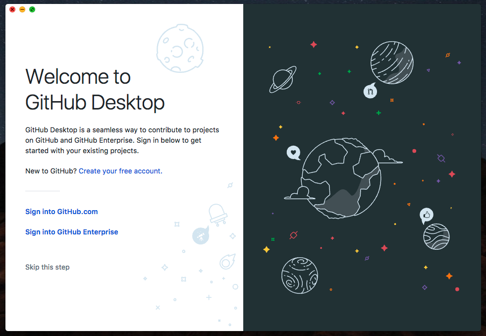
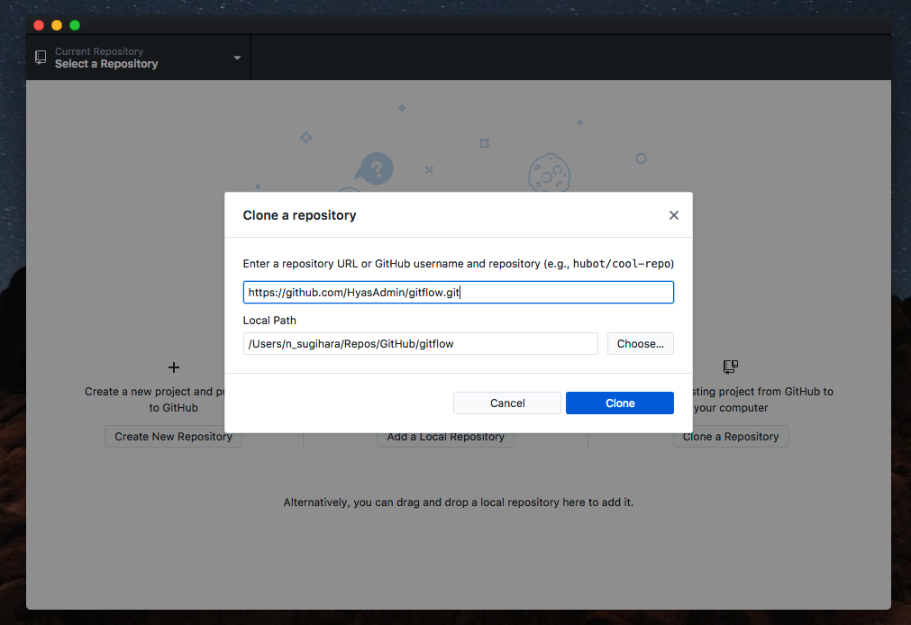
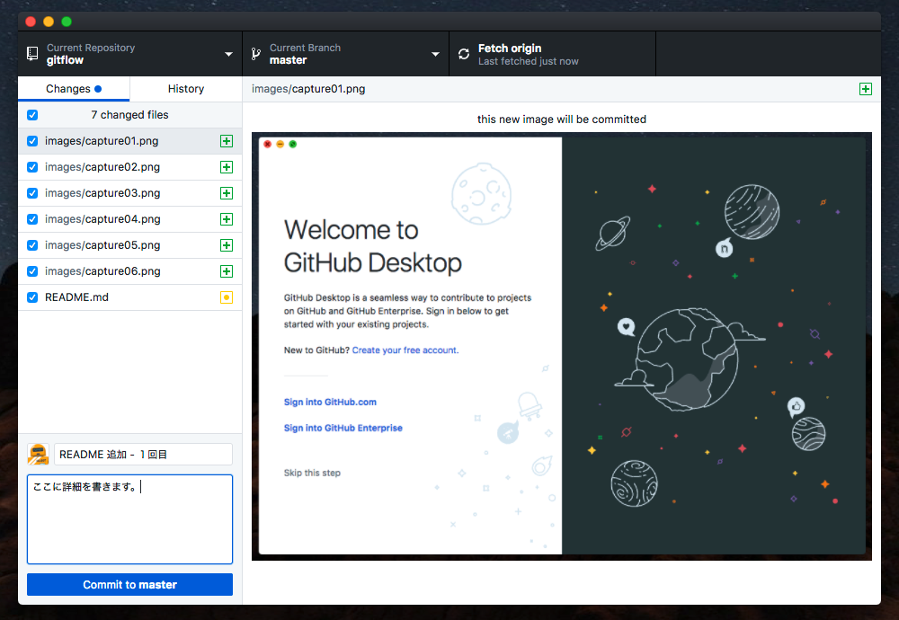
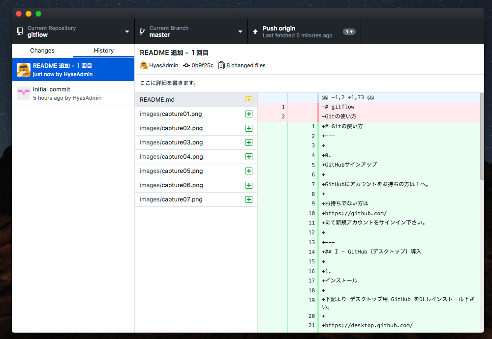
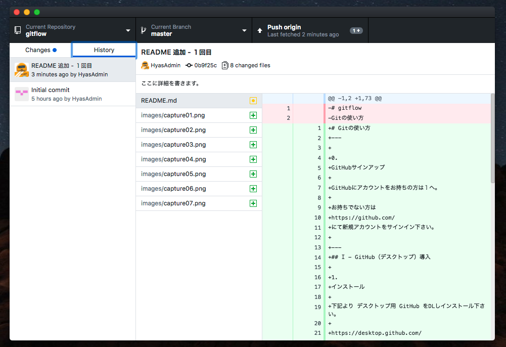
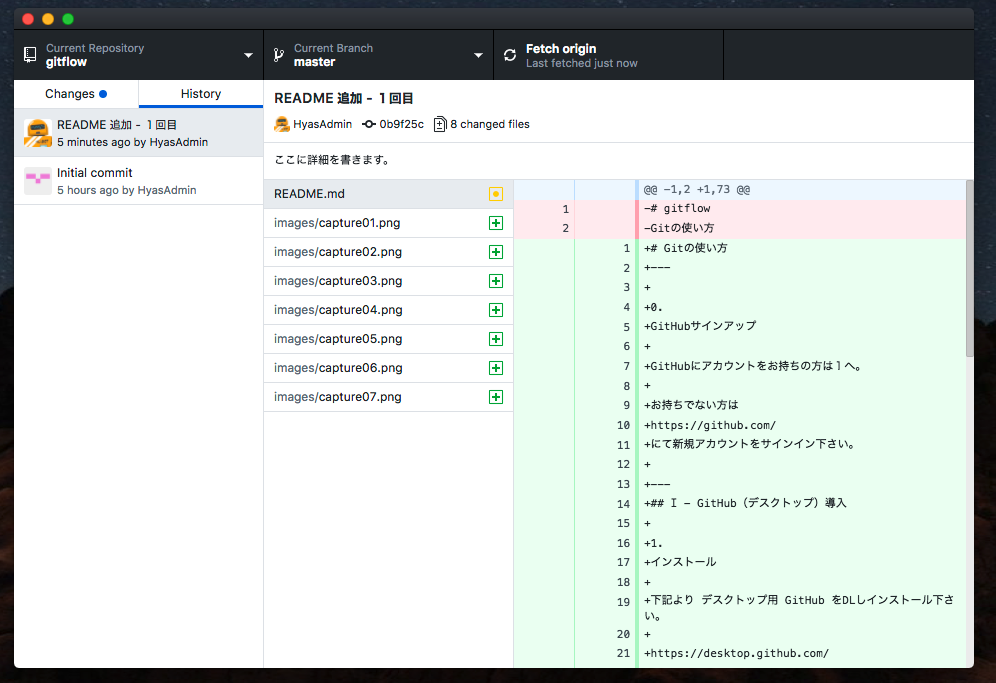
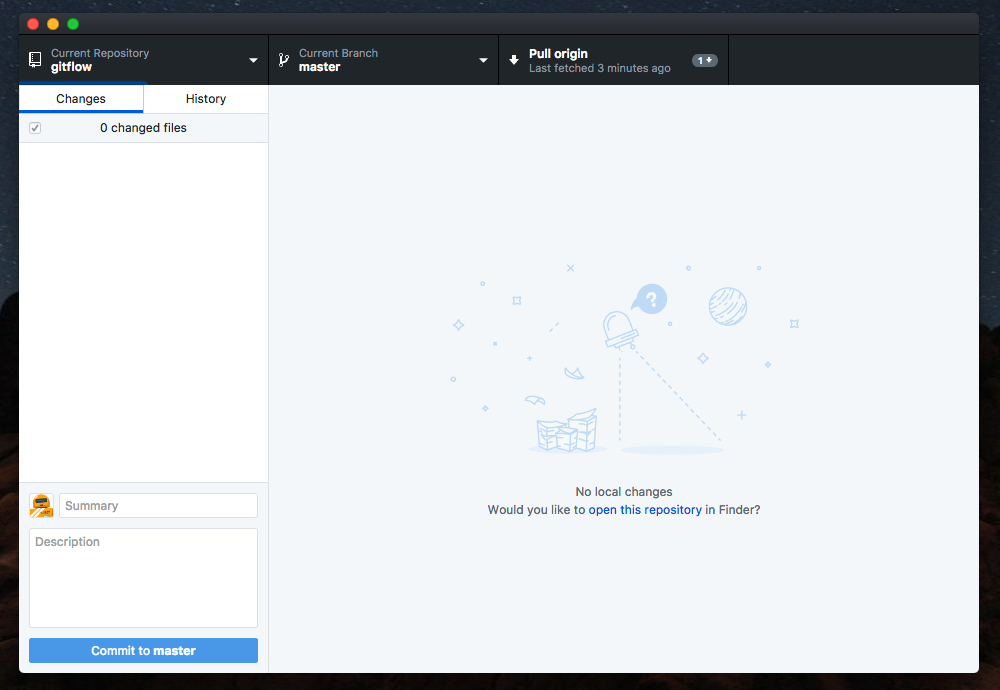

# Gitの使い方

0.GitHubサインアップ

GitHubにアカウントをお持ちの方は１へ。

お持ちでない方は
https://github.com/
にて新規アカウントをサインイン下さい。

---
## Ⅰ - GitHub（デスクトップ）導入

1.インストール

下記より デスクトップ用 GitHub をDLしインストール下さい。

https://desktop.github.com/

2.サインイン

アプリから Username と Password を入力しサインインして下さい。

3.リポジトリクローン

サインイン後、案内した リポジトリURL を入力し、ローカルマシンにリポジトリをクローンして下さい。

4.ディレクトリ作成

無事、指定フォルダにソースディレクトリが作成されていれば完了です。

---
## Ⅱ - Gitについて

1.Add

ソースを変更・追加すると下記のように GitHub が変更を検知します。

2.Commit

必要なファイルにチェックが付いていることを確認し、下部の Summary / Description へコメントを記入します。

Commitボタンを押すと、"0 changed files" となり、Historyタブに今回の変更がログとして追加されています。

3.Push

変更を反映したファイルをリポジトリにPushします。右上のPushボタンを押して下さい。

リロード後、ボタンのテキストが Push から Fetch になっていれば完了です。リモートリポジトリも同時に更新されます。

4.Pull

他のメンバーによる更新が先行していた場合、その変更を取り込んだ後に Push する必要があります。

右上のボタンが Pull に変わっていますので、押下してローカルマシンへ変更を取り込んで下さい。

その後、 3の通りに Push して完了です。

5.参考URL

Git を学ぶのに適したWebサイトを紹介します。

[ サルでもわかるGit入門 ]
https://www.backlog.jp/git-guide/

詳しい使い方については、他のサイトを参照下さい。

以上で、Gitのフローの説明とします。
