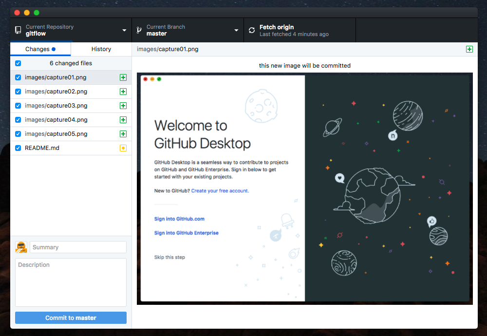

# Gitの使い方
---

0.
GitHubサインアップ

GitHubにアカウントをお持ちの方は１へ。

お持ちでない方は
https://github.com/
にて新規アカウントをサインイン下さい。

---
## Ⅰ - GitHub（デスクトップ）導入

1.
インストール

下記より デスクトップ用 GitHub をDLしインストール下さい。

https://desktop.github.com/

2.
サインイン

アプリから Username と Password を入力しサインインして下さい。

3.
リポジトリクローン

サインイン後、案内した リポジトリURL を入力し、ローカルマシンにリポジトリをクローンして下さい。

4.
ディレクトリ作成

無事、指定フォルダにソースディレクトリが作成されていれば完了です。

---
## Ⅱ - Gitについて

1.
Add

ソースを変更・追加すると下記のように GitHub が変更を検知します。

2.
サインイン

アプリから Username と Password を入力しサインインして下さい。

3.
リポジトリクローン

サインイン後、案内した リポジトリURL を入力し、ローカルマシンにリポジトリをクローンして下さい。

4.
ディレクトリ作成

無事、指定フォルダにソースディレクトリが作成されていれば完了です。
